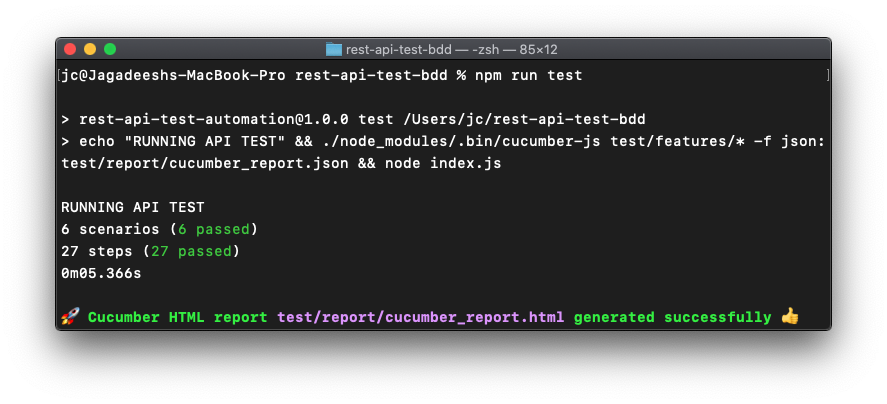
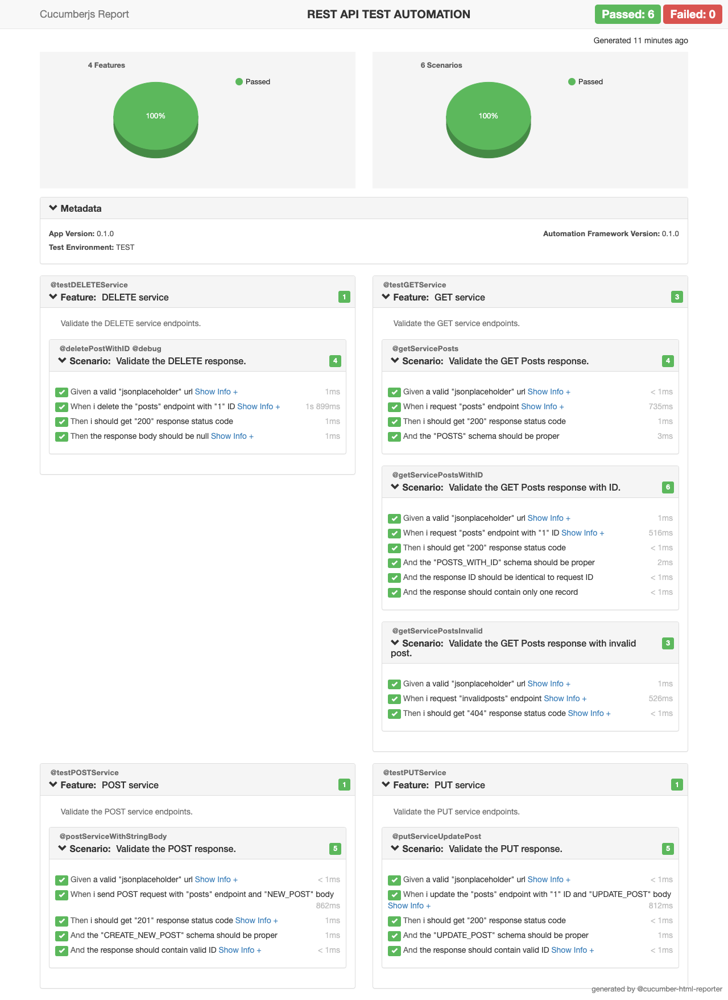

# 🛰️ [REST API Test Automation Framework Using BDD](https://github.com/jagadeeshshetty/rest-api-test-bdd/blob/master/README.md) 🚀

`Cucumber` `Javascript` `Axios`

## Run

### Install dependencies

`npm i`

### On macOS

`npm run test`

### On Windows OS

`npm run test_win`

## Test Execution Report

## Reference

[JSON Schema - Getting started step by step](https://json-schema.org/learn/getting-started-step-by-step.html)
[JSON Schema - Validator](https://jsonschemalint.com/#!/version/draft-07/markup/json)

**{ }** with ❤️ from [Jagadeesh C](https://www.linkedin.com/in/jagadeesh-c-2a3a9423)